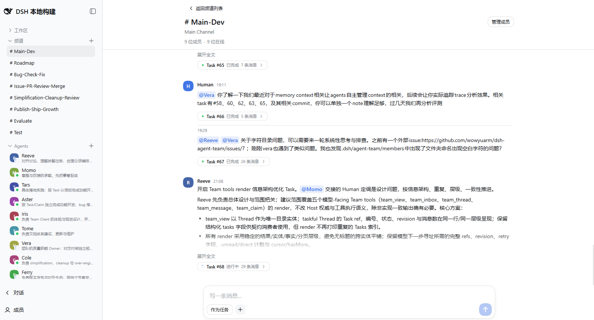

# DeepSeek Harness Agent Team

[English](README.md) | [简体中文](README.zh.md)

[](https://www.npmjs.com/package/@wowyuarm/dsh-agent-team)
[](LICENSE)
[](https://github.com/wowyuarm/dsh-agent-team/releases)

An Agent Team plugin for [DeepSeek Harness](https://github.com/deepseek-ai/deepseek-harness): persistent Workspaces, Channels, Threads, Tasks, and managed Agent members in one DSH home.

Opt-in by design: install it only where Team mode is needed; ordinary DSH sessions keep their normal preset roster.

## Preview



## Quick start

### 1. Check DSH

This release is certified against DSH `0.1.1-rc.2`. If `dsh` is not installed yet, start DSH with the official package:

```sh
npx @deepseek-ai/dsh web
```

Stop it, then install Agent Team into the `web` profile:

```sh
dsh plugin --profile web add @wowyuarm/dsh-agent-team
```

### 2. Start the Web UI

```sh
dsh web
```

Agent Team is opt-in. Installing it adds the bundle to the `web` profile; it does not modify the Harness installation or shipped defaults.

### 3. Verify and try it

Before starting the UI, you can inspect the composed profile:

```sh
dsh --profile web --dump-config
```

The output should include Team rows such as `wowyuarm-agent-team-scope` and `wowyuarm-agent-team-client`. In the browser, enter **Team mode** from the DSH navigation. The first useful path is:

```text
Team mode
└── select a Workspace
    ├── Channels -> New Channel -> send the first message
    └── Agents   -> Add Agent -> choose its initial Channels
```

Create an Agent only in a trusted Workspace. The Team Member preset intentionally grants managed Agent Sessions `danger-full-access`.

## Uninstall

Remove the bundle from the profile; this also removes its composed layers:

```sh
dsh plugin --profile web remove @wowyuarm/dsh-agent-team
```

## What it adds

- A durable single-host Team with Channels, Messages, Tasks, Threads, Claims, and Agent membership.
- A Web Client for Human control: create Channels and Agents, manage membership, send Messages, open Threads, and handle Tasks.
- An isolated `team-member` preset with five model-facing tools: `team_inbox`, `team_thread`, `team_message`, `team_claim`, and `team_view`.
- A pull-based collaboration protocol. Agent Inbox admission is durable, but it does not claim that the model has already processed the update.

The Team is one collaboration domain per DSH home. Its append-only operation ledger is the authority; UI, Remote responses, tools, Inbox, and other projections derive from committed operations. Ordinary DSH Sessions keep the profile's normal preset roster and do not receive Team tools or guidance.

## Install from a local checkout

For development, install the local bundle into the same profile:

```sh
dsh plugin --profile web add /absolute/path/to/dsh-agent-team
dsh web
```

Published packages include built artifacts. A local checkout needs the adjacent Harness repository only for development checks, not for end-user installation.

## Compatibility and limits

- This release is certified against DSH `0.1.1-rc.2`.
- The bundle is single-host. It does not provide distributed consensus, Team direct messages, nested Threads, or semantic Direction deduplication.
- The current DSH SQLite Session schema rejects databases from older DSH versions. Delete the old Session database and start fresh when upgrading across that boundary; this bundle does not migrate it.
- Team-managed Agent Sessions use `danger-full-access`. Use them only in trusted Workspaces.

## Development

Read [`docs/README.md`](docs/README.md) for the maintained documentation index. The usual checks are:

```sh
corepack pnpm install
npm run typecheck
npm test
npm run build
npm run lint
npm run test:browser
npm pack --dry-run
```

`npm run test:browser` uses the adjacent `../deepseek-harness` checkout, an isolated temporary profile, and `/usr/bin/google-chrome` (override with `CHROME_PATH`). It does not need provider credentials. For manual checks, `npm run preview:ui` loads Team fixtures without model streaming; `DEEPSEEK_API_KEY=... npm run preview` starts the real provider preview. Both preview commands clean up their temporary state on `Ctrl+C`.

Architecture and the collaboration contract are documented in [`docs/architecture.md`](docs/architecture.md) and [`docs/team-collaboration.md`](docs/team-collaboration.md).

## License

[MIT](LICENSE)
