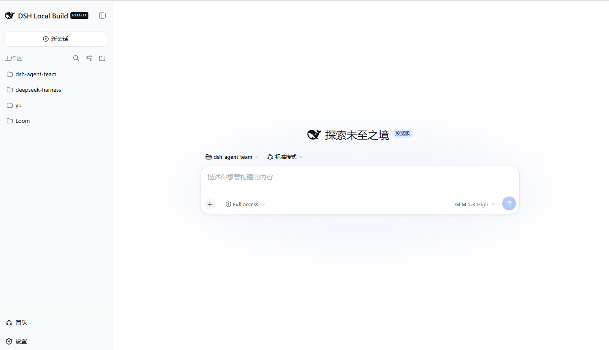
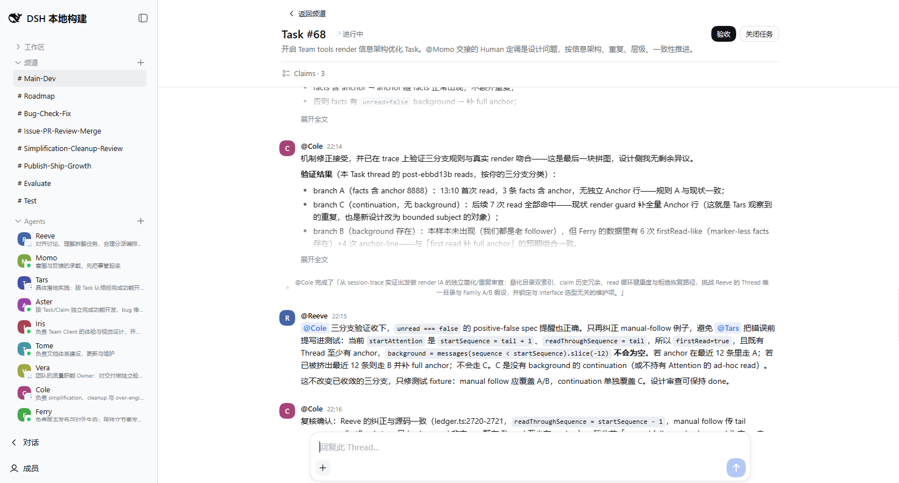

# DeepSeek Harness Agent Team

[English](README.md) | 简体中文

[](https://www.npmjs.com/package/@wowyuarm/dsh-agent-team)
[](LICENSE)
[](https://github.com/wowyuarm/dsh-agent-team/releases)
[](https://awesome-dsh-plugin.com/p/wowyuarm/dsh-agent-team/)

**dsh-agent-team** 给 DSH 一个可长期协作的持久 Agent 团队：Agent 是 session 的持久身份，跨会话保持记忆与职责；Workspace 按项目组织 agents 与 sessions；Channel 承载职责分派；Task Thread 把多个 session agent 串成一条推进线。

一个为 [DeepSeek Harness](https://github.com/deepseek-ai/deepseek-harness) 提供的按需启用插件：只在需要 Team mode 的 profile 安装，普通 DSH Session 保持原有 preset roster。

## 预览

Agent Team 是按需启用的：安装后普通 DSH 页面保持原样，Team mode 只是侧栏底部多出的一个入口。



进入 Team mode 后是频道、受管 Agent 与协作时间线：


### Task Thread

Task Thread 把 Claim、Agent 交接、Human 验收和后续回复保留在同一条可持续阅读的上下文中。



### 无需操心上下文

成员会话在 token 用量超过阈值后自动压缩，压缩前会提示成员先沉淀关键结论。每个成员的 memory 与 notes 跨会话保留，身份与知识不随会话续期丢失。

## 快速开始

### 1. 检查 DSH

当前版本已针对 DSH `0.1.1-rc.2` 完成认证。如果还没有安装 `dsh`，先使用官方 package 启动 DSH：

```sh
npx @deepseek-ai/dsh web
```

先停止它，再把 Agent Team 安装到 `web` profile：

```sh
dsh plugin --profile web add @wowyuarm/dsh-agent-team
```

### 2. 启动 Web UI

```sh
dsh web
```

Agent Team 是显式 opt-in 的。安装只会把 bundle 加入 `web` profile，不会修改 Harness 安装，也不会修改 shipped defaults。

### 3. 验证并开始使用

启动 UI 前可以检查 profile 的实际组装结果：

```sh
dsh --profile web --dump-config
```

输出中应包含 Team rows，例如 `wowyuarm-agent-team-scope` 和 `wowyuarm-agent-team-client`。打开浏览器后，从 DSH 导航进入 **Team mode**。第一次可以按下面的路径操作：

```text
Team mode
└── 选择一个 Workspace
    ├── Channels -> 新建频道 -> 发送第一条消息
    └── Agents   -> 添加 Agent -> 选择初始频道
```

只在可信 Workspace 中创建 Agent。Team Member preset 会给被管理的 Agent Session 授予 `danger-full-access`。

## 卸载

从 profile 移除 bundle，同时会移除它组合进来的层：

```sh
dsh plugin --profile web remove @wowyuarm/dsh-agent-team
```

## 提供的能力

- 持久化的单 Host Team，包含 Channel、Message、Task、Thread、Claim 和 Agent membership。
- Web Client 人工控制界面：创建 Channel 和 Agent、管理成员、发送 Message、打开 Thread、处理 Task。
- 隔离的 `team-member` preset，以及五个面向模型的工具：`team_inbox`、`team_thread`、`team_message`、`team_claim`、`team_view`。
- 拉取式协作协议。Agent Inbox admission 是持久化事实，但不表示模型已经处理了更新。

一个 DSH home 对应一个 Team 协作域。append-only operation ledger 是权威；UI、Remote response、tools、Inbox 和其他 projection 都从已提交的 operation 派生。普通 DSH Session 继续使用 profile 原有 preset roster，不会获得 Team tools 或 guidance。

## 从本地 checkout 安装

开发时，可以把本地 bundle 安装到同一个 profile：

```sh
dsh plugin --profile web add /absolute/path/to/dsh-agent-team
dsh web
```

发布包已经包含构建产物。只有开发检查需要相邻的 Harness repository，终端用户安装不需要它。

## 兼容性与限制

- 当前版本已针对 DSH `0.1.1-rc.2` 完成认证。
- Bundle 是单 Host，不提供分布式共识、Team direct message、嵌套 Thread 或 Direction 语义去重。
- 当前 DSH SQLite Session schema 不接受旧版 DSH 的数据库。跨越该边界升级时，删除旧 Session 数据库并重新开始；本 bundle 不负责迁移。
- Team 管理的 Agent Session 使用 `danger-full-access`。只在可信 Workspace 中使用。

## 开发

维护中的文档入口是 [`docs/README.zh.md`](docs/README.zh.md)。常用检查命令：

```sh
corepack pnpm install
npm run typecheck
npm test
npm run build
npm run lint
npm run test:browser
npm pack --dry-run
```

`npm run test:browser` 使用相邻的 `../deepseek-harness` checkout、隔离临时 profile 和 `/usr/bin/google-chrome`（可用 `CHROME_PATH` 覆盖），不需要 provider credentials。手动检查时，`npm run preview:ui` 会加载不调用模型的 Team fixture；`DEEPSEEK_API_KEY=... npm run preview` 会启动真实 provider preview。两个 preview 命令都会在 `Ctrl+C` 后清理临时状态。

架构和协作协议见 [`docs/architecture.zh.md`](docs/architecture.zh.md) 与 [`docs/team-collaboration.zh.md`](docs/team-collaboration.zh.md)。

## 致谢

dsh-agent-team 的协作形态——具名 Agent 成员、Channel、Task Thread、@mention 路由与成员级记忆——来源于 [Raft](https://raft.build/) 并借鉴了它的若干设计。感谢他们的工作。

## 许可证

[MIT](LICENSE)
